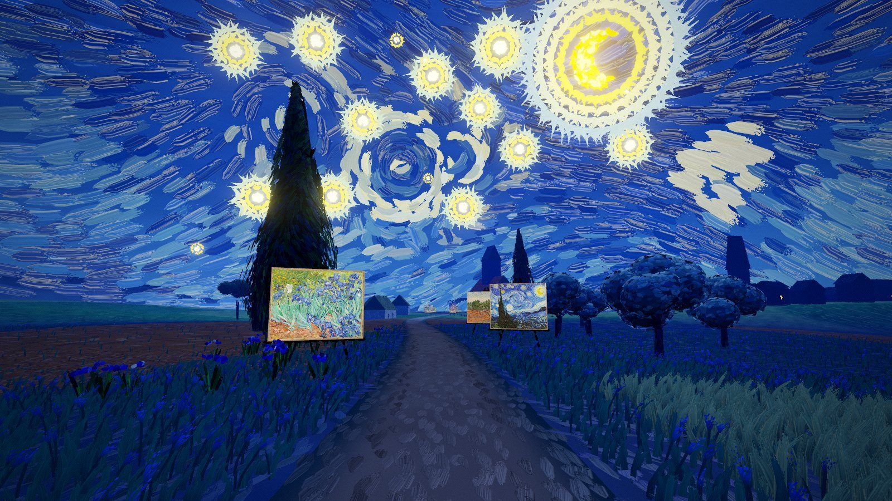
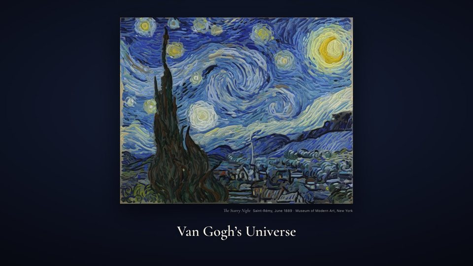
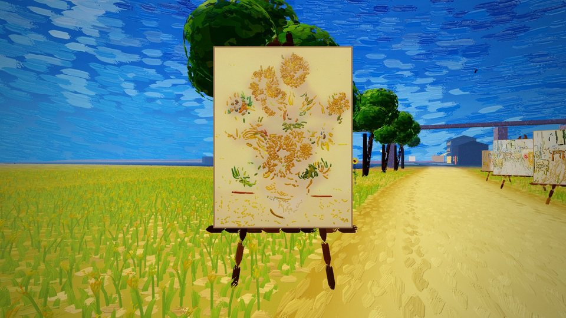
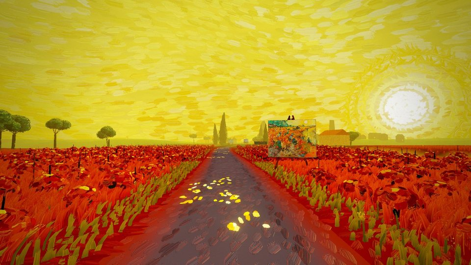
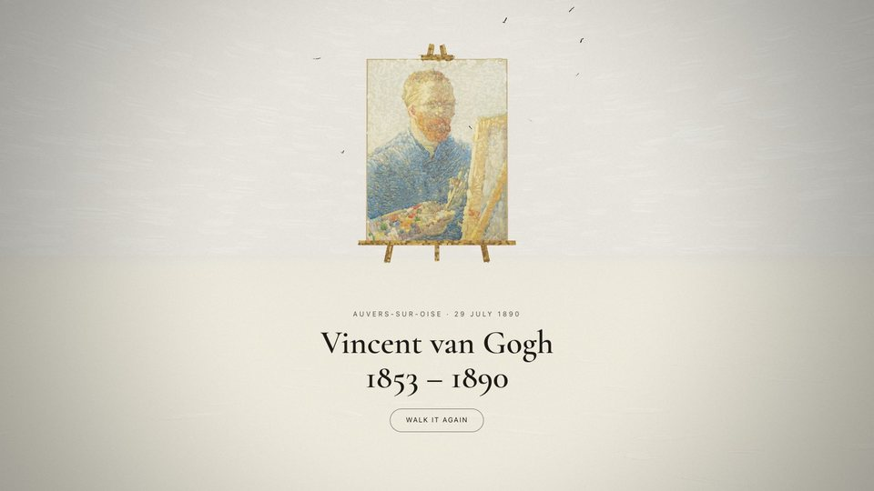

# The World of Van Gogh

<p align="center">
  
</p>

A walk into the paintings of Vincent van Gogh, one after another, in which each canvas paints itself stroke by
stroke and then becomes the world around you.

You stand in front of *The Starry Night*. It paints itself, you go into it, and you are standing in that night at
Saint-Rémy. You walk a little way down the road and there is another canvas across it, *The Red Vineyard*, painting
itself as you come; you walk through it, and the world goes over to the vineyard from where you stand outward.
Thirteen paintings stand along the road this way, each the door into its own world: the night, the vineyard, the
orchards, the harvest, the Yellow House, the pink orchard, the olive trees under the Alpilles, the café terrace, the
Rhône at night, Saint-Rémy by day, a field of sunflowers, Auvers and the wheatfield. Each canvas is
made of its own brushstrokes, extracted from a museum's photograph, and laid down again in the order he laid them.
The land at each is painted in the colours of that canvas. Then the wheat goes to nothing, and on bare primed canvas
at the end of the road *Self-Portrait as a Painter*, thirty-six metres tall on an easel, paints itself last: the one
painting you cannot enter.

The subject is not his places but the act of painting them. The piece is one HTML page and a folder of ES modules,
with three.js from a CDN and no build step.

<p align="center">
  
  
  
  
</p>

## Run it

Serve the folder over HTTP (import maps and `fetch` do not work from `file://`) and open it in a browser with
WebGL 2:

```bash
python3 -m http.server 8710
```

Then visit <http://127.0.0.1:8710/>. Any static host works the same way, with one catch: a host that keeps `.js`
files as immutable, as the one this is deployed to does, gives a browser that has been there before the new page and
its old scripts. `tools/deploy.py` deploys a commit with every script asked for by its content, so a changed script
is fetched again and an unchanged one stays in the cache.

The page draws each canvas from its stroke record, `strokes/sNN/<slug>-canvas.bin`, with an underlayer image
beside it. The records for all thirty-one canvases are in the repository and come to 12 MB. The 1.7 GB of museum
scans they were extracted from are not: you need those only to change a canvas or add one (see
[Rebuilding the stroke records](#rebuilding-the-stroke-records)).

It has been measured in headless Chrome on a Mac. The resolution adapts to hold the frame rate, and a touch screen
gets a smaller budget and two-thumb controls, but no real phone has been measured yet.

## Controls

| | Keyboard and mouse | Touch |
|---|---|---|
| Walk | ↑ ↓ or W S, or the scroll wheel; Shift runs | the left thumb, up and down |
| Turn | ← →; A D step sideways | the left thumb, sideways |
| Look around | drag | the right thumb |
| Walk on its own | Space; ← → steer it off the road, ↑ ↓ take over | |
| Walk faster | X, or the 1× button: 1.5×, 2×, 3× and back | the 1× button |
| Lie down and look up | Z | |
| Go to a painting | 1 to 9, and 0 for the tenth; the line along the bottom reaches all fourteen | tap the line |
| Sound | M, or the speaker button | the speaker button |
| The keys | H or ? | the keyboard button |
| Full screen | F | the full-screen button |

Walking through a canvas is the only way from one world to the next; there is no button. Walking back through it
takes you back. The walk on its own keeps to the road: drag to look around and it walks on regardless. ← → steer
it off the road, and once let go it finds the road again. It slows a little at each door, and stops eighty metres
short of the portrait, with the whole of it in view. The rest of the road, up to it, is for a hand.

The 1× button in the corner, or X, sets the walking speed. Every way of walking, the walk on its own included,
goes one and a half, two or three times as fast, and turning does not. Each world is 36 m of road, eight seconds at
a walk and ten on its own; the whole road, on its own, takes about three and a half minutes at 1×. A door paints
itself in seven seconds from 34 m, so at a walk its last strokes land as you reach it, and at 3× you go through
it half painted.

## The walk

| | The painting | Its world |
|---|---|---|
| 1 | *The Starry Night*, June 1889 (the opening) | Saint-Rémy at night: the cypress, the olives, the village under that sky |
| 2 | *The Red Vineyard*, November 1888 | a red vineyard by a canal, after the rain, under a low sun |
| 3 | *Almond Blossom*, February 1890 | the orchards outside Arles, white and pink, in blossom |
| 4 | *The Harvest*, June 1888 | La Crau: wheat, haystacks and the blue cart |
| 5 | *The Bedroom*, October 1888 | the Yellow House on Place Lamartine, with the railway bridge |
| 6 | *The Pink Orchard*, April 1888 | an orchard of apricot trees in blossom, with the reed fence behind |
| 7 | *Olive Trees with the Alpilles in the Background*, June 1889 | olives on a writhing ground, the Alpilles blue across the sky |
| 8 | *Café Terrace at Night*, September 1888 | the Place du Forum at Arles after dark: the lit terrace, the lamps, the dark houses |
| 9 | *Starry Night Over the Rhône*, September 1888 | the quay at Arles, the gaslights laid on the water, the Dipper overhead |
| 10 | *Irises*, May 1889 | Saint-Rémy by day: the same cypresses and olives, irises either side of the road |
| 11 | *Sunflowers*, January 1889 | a field of sunflowers to the horizon, which he did not paint |
| 12 | *The Church at Auvers*, June 1890 | Auvers-sur-Oise: thatch, gardens, the church |
| 13 | *Wheatfield with Crows*, July 1890 | the wheatfield above the village, in the wind, with crows |
| 14 | | bare primed canvas, and the road across it to *Self-Portrait as a Painter*, 36 m tall |

The order is the author's and is not the order he painted them in. The field of sunflowers is not a place he
painted: it is made from the still life's yellows, under the licence he gave himself with colour. The café is at
Arles, not Paris, whatever it is called in conversation. The other twenty canvases whose stroke records are in the
repository are not on the road; the station files still list them, with the notes on where they stood.

## How it works

### The strokes

The strokes are extracted offline, in Python (`tools/`), from a museum scan of each canvas at about 120 pixels a
centimetre:

1. an orientation field from the structure tensor at three scales;
2. ridges, found on luminance and also on colour where luminance has nothing to say, because he often laid one loaded
   colour beside another of the same value;
3. each ridge traced along the field into a stroke: a curve, a width, a colour and a height;
4. an underlayer image for the passages no stroke carries;
5. an order for the strokes, described in the next section;
6. everything packed at 24 bytes a stroke.

The thirty-one canvases on the easels come to 326,887 strokes; *Wheatfield with a Reaper* alone has 18,924. Every
number the extractor uses lives in `params/<slug>.json`, merged over `params/_base.json`. Every build is compared
with its golden image in `strokes/golden/`, a flat render and a height map of each canvas at 1200 px.

### What is evidence and what is invention

Where two strokes cross, one is on top, and the photograph shows which. The pipeline reads every such overlap by
asking, at each point, which of all the marks covering it is the paint you can see. It then solves a sequence that
respects those facts. That recovers local order, not the order of the whole canvas. On crossings held back from the
solver it gets 53–59% right, where his habits alone get 42–46%, and the margin shrinks as the strokes get further
apart.

Most pairs of strokes never touch, and those are put in order by his habits. Thin and dark goes before thick and
light, sky before land, the contours late, and the brightest impasto last. So the solved sequence still correlates
0.89 with the habits it started from.

The timing is invented: every canvas paints itself in thirteen seconds, and the portrait at the end in twenty,
or sooner if you walk up to it.
The strokes are fitted to flat-lit photographs, so they are a reading of the paint, not a measurement of it; a scan
keeps no shadow of the relief. And the world between the canvases is not his. It is painted procedurally, in colours
sampled from his canvases of each place and pushed the way he pushed them. `DESIGN.md` §4.3 and the M2 entry in
`BUILD.md` give the measurements.

### The world

The runtime (`src/`) is ES modules on three.js r180.

- **The road and the worlds.** One road runs 36 m from one door to the next. A ground table, a small float texture
  with a column per world, holds each one's crops, colours, wind and water. The shape of the land is the road's,
  the same function in GLSL and JavaScript, line for line; everything painted on it is the world you are in.
  Going through a door changes the world, and the change spreads from where you stand: the ground behind a ragged
  front that runs out to 560 m in three seconds, the sky stroke by stroke from the way you were walking, the
  light, the sound, and the things standing in the land, which paint themselves in from the door outward while the
  old world's paint themselves out.
- **The sky and the ground.**
  - The sky is a painted dome with 11,000 to 24,000 marks laid along a flow field and curled round turning eddies.
    *The Starry Night*'s eddies are placed from the canvas.
  - The ground carries about 191,000 marks that follow the camera and are worked out on the GPU.
  - Everything standing is made of marks on its surface: trees, houses, vines, sunflowers, the church.
- **The canvases.** Each draws its strokes as instanced ribbons with a procedural brush that has bristles, a loaded
  start, a dry end and a height, lit by the world's light. A door stands across the road with its foot on the
  ground, 2.6 m tall for a landscape and 3 m for a portrait, and comes towards you over the last nine metres.
- **Sound** is generated on the spot: wind, birds, crickets, the river, the crows, your steps, the bristles on the
  cloth while a canvas paints, and a quiet chord that changes key from place to place.
- **The opening** is *The Starry Night* painted from its own stroke record, 13,999 strokes in 3.2 seconds, in a
  worker so that building the world cannot stall it.

### His words

The lines from his letters are no longer shown on the road. They stay in `letters/`, with `tools/letters.py`, which
checked each against the Van Gogh Museum and Huygens ING edition, and `letters/README.md` says how.

## URL parameters

These exist for testing and for reproducing a frame.

| Parameter | Effect |
|---|---|
| `?at=N` | start in world N, 1 to 14, without the opening |
| `?notitle` | skip the opening |
| `?q=low`, `mid`, `high` | the resolution budget; `mid` by default, `low` on touch screens |
| `?painted` | everything already painted |
| `?t=seconds` | freeze the clock, so that frames repeat |
| `?debug` | a readout of frame rate, position, the world you are in and how far the change has run |

## Debug API

`window.vgu` exposes the state and a few controls for headless checks.

- `vgu.state()` returns position, the world you are in and the one before, how far the change has run, frame
  rate, whether the walk is on its own, and the walking speed (`pace`).
- `vgu.go({ station, dz, x, z, yaw, pitch, lie })` puts you somewhere, whole, and `vgu.jump(n)` travels to a world
  as the line does.
- `vgu.easels()` lists every door and the portrait; `vgu.door(n, metres)` stands you in front of the door into
  world n, in the world before it; `vgu.enter(n)` goes through it from where you stand; `vgu.wipe(t)` holds the
  change at t (and `vgu.wipe(null)` lets it go); `vgu.where()` is the world state.
- `vgu.auto(on)` and `vgu.forward(f)` are a hand: the walk on its own, and the forward key held.
- `vgu.paint()` finishes every painting, and `vgu.freeze(t)` stops the clock.
- `vgu.layers({ sky, ground, props, paintings })` shows or hides a layer.
- `vgu.coda()` reports the portrait at the end: where it is, and how far through painting itself.

## Rebuilding the stroke records

The records the page needs are already here; this is for changing a canvas or adding one. You need the scans,
Python 3.9 or later, and a few minutes a canvas.

```bash
python3 -m venv .venv
.venv/bin/pip install numpy scipy pillow opencv-python-headless   # OpenCV only for tools/room.py
.venv/bin/python tools/fetch.py
.venv/bin/python tools/make.py harvest --out strokes/s04
```

- **The scans.** `tools/fetch.py` downloads the scans listed in `tools/sources.tsv` into `ref/originals/`. Most
  canvases' parameters name those files as they arrive. A few were stitched from tiles at full resolution
  (`tools/micrio_stitch.py`), found on Wikimedia Commons (`tools/commons_resolve.py`, `tools/fetch_commons.py`) or
  cropped by hand. `paintings/CREDITS.md` records every one: its holder, its accession number, its resolution and
  what was done to it.
- **One canvas.** `tools/make.py <slug> --out strokes/sNN` builds one canvas and reports whether its golden image
  moved. The slug is its file in `params/`, and `sNN` is its place's number.
- **The audits.**
  - `tools/make.py --check` audits the parameters.
  - `tools/station.py` checks the station files against the blobs.
  - `tools/letters.py --check` checks the letters against the edition.

## Repository layout

```
index.html            the page: markup, CSS, the opening, and the import map for three.js
src/                  the runtime: the road, the art direction of each place, the sky, the ground, what stands
                      in the land, the canvases, the post-processing, the sound and the interface
stations/             one file per place: its canvases and their dates, its span, and his line; config.js says which
                      of them are on the road, and which canvas is each world's door
letters/              the quotations, how to check them, and their licence (no longer shown on the road)
paintings/CREDITS.md  every canvas, its collection, and the scan its strokes came from
params/               the extraction parameters for each canvas
tools/                the offline pipeline: gathering the scans, extracting and ordering the strokes, packing
                      the records, and the audits; and deploy.py, which puts a commit on the live site
strokes/golden/       the pipeline's regression images
strokes/sNN/          the stroke records the page loads, each with its underlayer
ref/                  not in the repository: the museum scans
DESIGN.md             the design, written before the build, with the author's later changes at the top
BUILD.md              the build plan, then the log
.claude/launch.json   the dev server for Claude Code's browser pane
```

`BUILD.md` is the log of how this was made, milestone by milestone, from one tile of the Reaper standing up to the
portrait at the end. Each entry records what was decided and what was measured, and most end with what is still
visible, named rather than fixed. That part is worth reading before trusting anything above.

## Credits and licence

- **The code** is released under the MIT licence; see `LICENSE`.
- **The paintings** are by Vincent van Gogh (1853–1890) and are in the public domain. `paintings/CREDITS.md` lists
  every canvas, its collection and the reproduction its strokes were extracted from. The scans themselves are not
  here.
- **The letters** are quoted from *Vincent van Gogh – The Letters*, edited by Leo Jansen, Hans Luijten and Nienke
  Bakker (Van Gogh Museum and Huygens ING, <https://vangoghletters.org>). They are used under the edition's
  CC BY-NC-SA 4.0 licence. The quotations in `letters/` and the `letter` in each station file are under that licence,
  not MIT.
- **three.js** is used under the MIT licence, from jsDelivr, and Cormorant Garamond comes from Google Fonts.
- **The first-person world of paint** follows its sibling,
  [Monet's Universe](https://github.com/Victor-EU/monets-universe), and through it *A town made of paint*
  (van-goghs-town.surge.sh). `DESIGN.md` §2 says what was kept and what had to be different.
